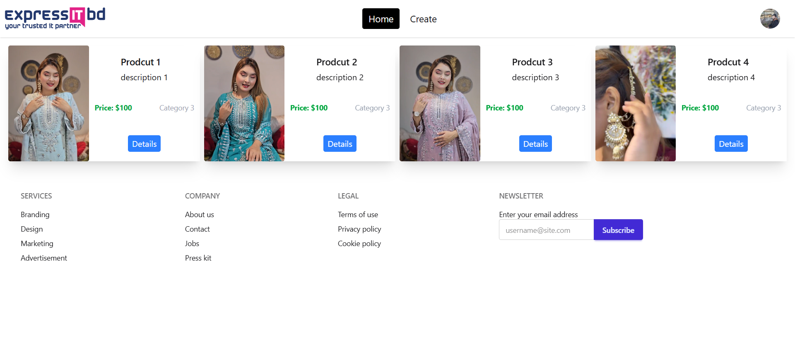
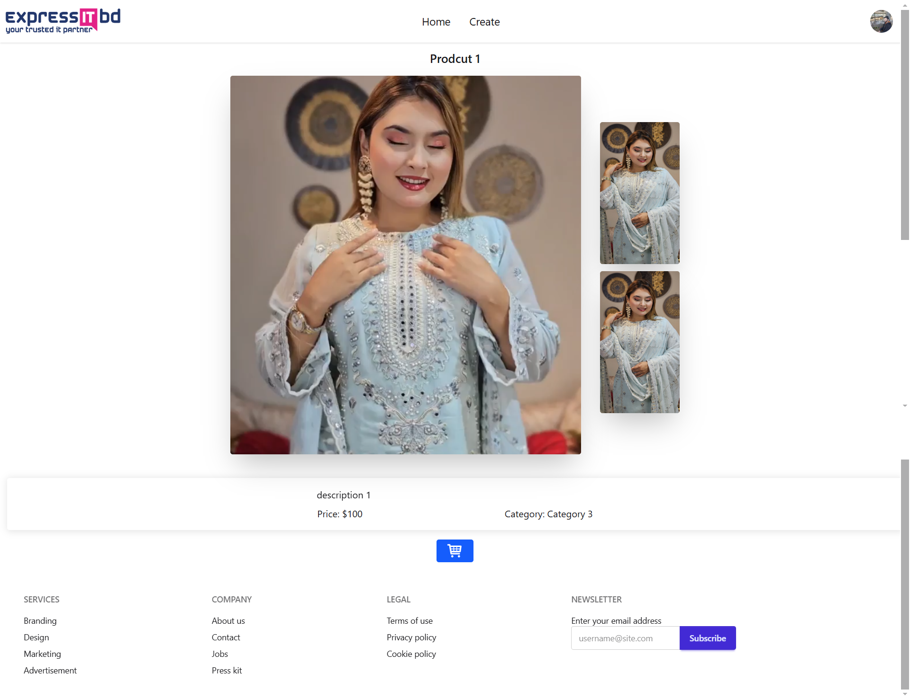
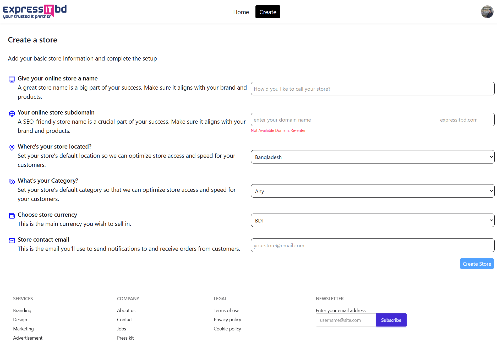

# 📦 Express IT BD – Frontend Developer Task

This project is a submission for the **Frontend Developer** position at **Express IT BD**. It showcases a responsive web application built using **React 19**, integrating APIs to fetch and display data dynamically.

---

## 📋 Table of Contents

1. [💡 Project Overview](#-project-overview)
2. [🚀 Features](#-features)
3. [🛠️ Tech Stack](#%EF%B8%8F-tech-stack)
4. [📂 Folder Structure](#-folder-structure)
5. [⚙️ Getting Started](#%EF%B8%8F-getting-started)
6. [🖼️ Screenshots](#%EF%B8%8F-screenshots)
7. [📈 Performance Optimizations](#%EF%B8%8F-performance-optimizations)
8. [📑 License](#-license)
9. [✉️ Contact](#-contact)

---

## 💡 Project Overview

The project consists of two main tasks:

1. **Domain & Store Creation:**
   - Check domain availability via API.
   - If unavailable, create a store using a POST request.

2. **Product Display:**
   - Fetch products from API.
   - Display them in a responsive grid.
   - Enable dynamic routing to view individual product details.

---

## 🚀 Features

- ✅ Domain availability check.
- ✅ Dynamic store creation.
- 🛍️ Product listing with dynamic routing.
- 📱 Fully responsive design (Desktop, Tablet, Mobile).
- ⚡ Optimized performance (lazy loading, memoization).
- 💅 Custom UI with Tailwind CSS.

---

## 🛠️ Tech Stack

- **Frontend:** React 19
- **Styling:** Tailwind CSS
- **API Calls:** Axios / Fetch API
- **State Management:** React Query / Context API
- **Routing:** React Router
- **Build Tool:** Vite.js

---

## 📂 Folder Structure

```
expressitbd-frontend-task/
│── .gitignore
│── eslint.config.js
│── index.html
│── package-lock.json
│── package.json
│── README.md
│── vite.config.js
│
├── public/
│   ├── logo.png
│   ├── me.jpg
│
├── assets/
│   ├── home.png
│   ├── details.png
│   ├── create.png
│
├── src/
│   ├── App.css
│   ├── App.jsx
│   ├── index.css
│   ├── main.jsx
│   │
│   ├── assets/
│   │   ├── react.svg
│   │
│   ├── Component/
│       ├── Api/
│       │   ├── ProductApi.jsx
│       │
│       ├── CreateProduct/
│       │   ├── CreateProduct.jsx
│       │   ├── CreateProductHeader/
│       │   │   ├── CreateProductHeader.jsx
│       │
│       ├── Details/
│       │   ├── Details.jsx
│       │
│       ├── Footer/
│       │   ├── MyFooter.jsx
│       │
│       ├── Header/
│       │   ├── MyHeader.jsx
│       │
│       ├── Home/
│       │   ├── Card.jsx
│       │   ├── Home.jsx
│       │
│       ├── Outlet/
│       │   ├── MyOutlet.jsx

```

---

## ⚙️ Getting Started

### 1️⃣ Clone the repository

```bash
git clone https://github.com/ilhamclive/expressitbd-frontend-task.git
cd expressitbd-frontend-task
```

### 2️⃣ Install dependencies

```bash
npm install
# or
yarn install
```

### 3️⃣ Run the development server

```bash
npm run dev
# or
yarn dev
```

### 4️⃣ Build for production

```bash
npm run build
# or
yarn build
```

### 5️⃣ View the production build

```bash
npm run preview
# or
yarn preview
```

---

## 🖼️ Screenshots

### Home Page
The following screenshot shows the Home page layout:



### Product Details
The following screenshot shows the Product Details page:



### Create Store
The following screenshot shows the Create Store:



---

## 📈 Performance Optimizations

- Implemented lazy loading for components.
- Memoization using React.memo and useMemo.
- Optimized API calls with React Query.
- Debounced user inputs.

---

## 📑 License

This project is licensed under the [MIT License](LICENSE).

---

## ✉️ Contact
For any issues or inquiries, please contact me at [ilhamclive@example.com]

---

🚀 **Happy Coding!** 🚀
